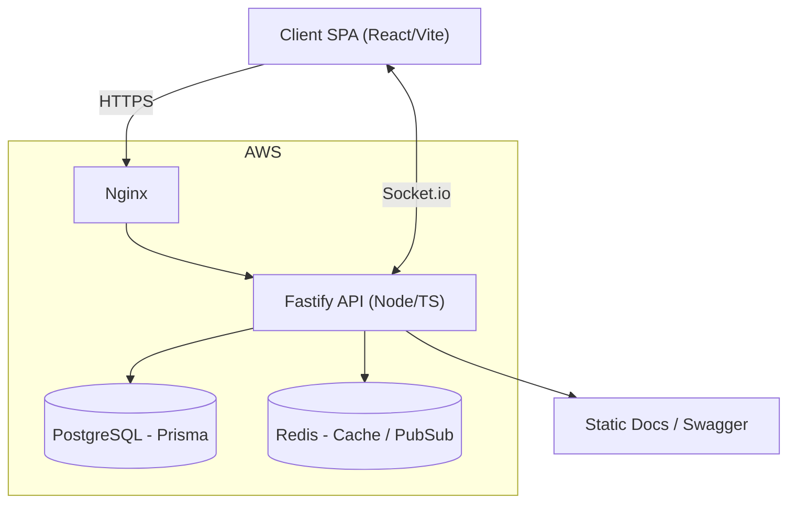
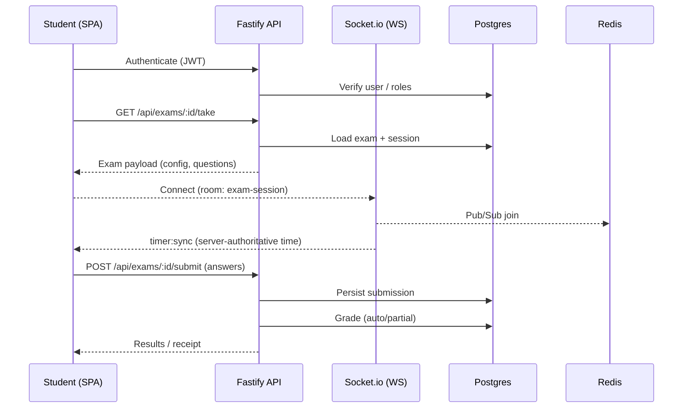
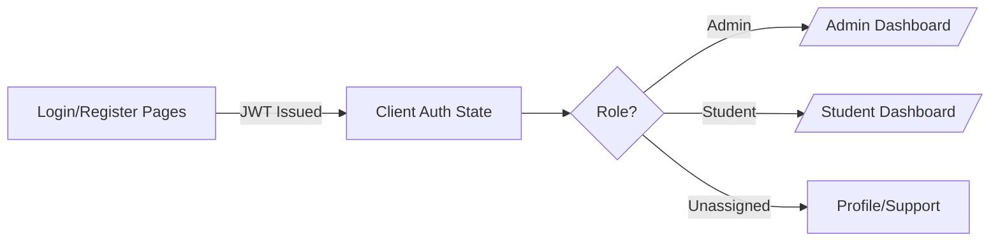
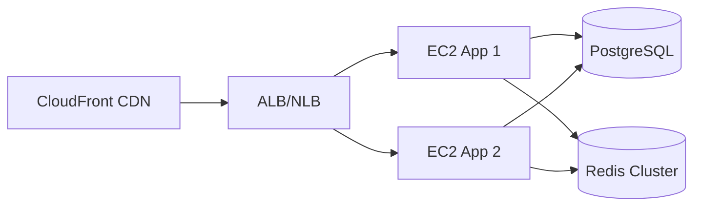
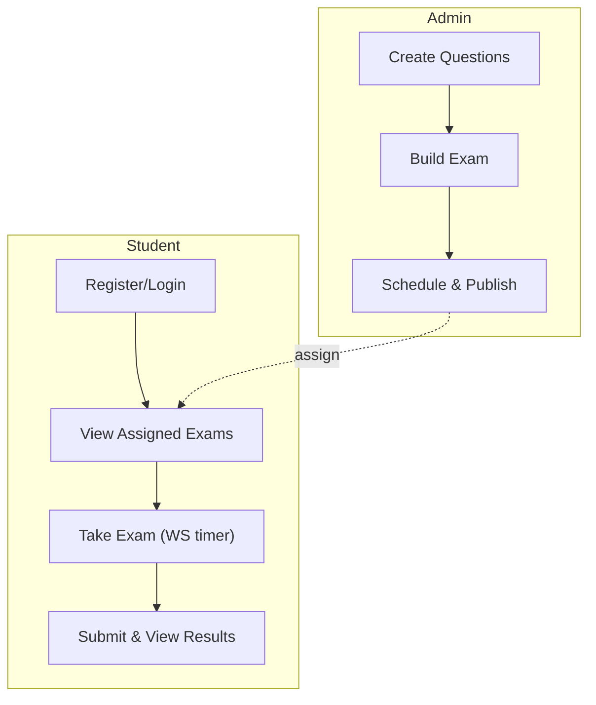

# GMATHS Platform — System Overview and Assessment

A concise, multi-perspective overview of the GMATHS Education online testing platform. This document summarizes architecture, code structure, product functionality, and prioritized next steps.

- For setup and scripts: see [docs/setup.md](docs/setup.md)
- For deployment details: see [docs/deployment.md](docs/deployment.md) and [deploy/README.md](deploy/README.md)
- For full plan and status: see [.cursor/implementation-plan.md](.cursor/implementation-plan.md), [.cursor/product-requirements.md](.cursor/product-requirements.md), and [.cursor/logs.md](.cursor/logs.md)
- For style and testing conventions: see [.cursor/style-guide.md](.cursor/style-guide.md)

## Table of Contents

1. Executive Summary
2. Architecture Overview
3. Backend Codebase
4. Frontend Codebase
5. Security, Roles & Permissions
6. Data & Persistence
7. Testing & Quality
8. Deployment & Operations
9. Product View: Features & Flows
10. Actionable Recommendations
11. Open Questions

## 1) Executive Summary

- The project is a TypeScript monorepo with a Fastify backend and a React + Vite frontend, aligned to a phased roadmap (MVP → Content/Comms → Insights → Proctoring → Scale-out).
- Phase 1 (MVP) is implemented and documented. Real-time exam timer, question bank, grading, results, and Vietnamese UI are in place per [.cursor/logs.md](.cursor/logs.md).
- The code follows strong conventions (Zod validation, Prisma ORM, Socket.io, TanStack Query), with comprehensive docs and deployment scripts.
- Recommended near-term focus: finalize Content/Comms (posts/news), unify RBAC enforcement in API, formalize observability, and capture a single source of truth for permissions and roles in code/docs.

## 2) Architecture Overview

High-level system topology.



Key back-end entrypoints:

- [backend/src/server.ts](backend/src/server.ts) — Fastify bootstrap, plugins, OpenAPI, Socket.io wiring
- [backend/src/app.ts](backend/src/app.ts) — Service app composition and route registration
- Important route modules:
  - [`routes.authRoutes`](backend/src/routes/authRoutes.ts)
  - [`routes.adminRoutes`](backend/src/routes/adminRoutes.ts)
  - [`routes.questionRoutes`](backend/src/routes/questionRoutes.ts)
  - [`routes.examRoutes`](backend/src/routes/examRoutes.ts)
  - [`routes.timerRoutes`](backend/src/routes/timerRoutes.ts)
  - [`routes.gradingRoutes`](backend/src/routes/gradingRoutes.ts)
  - [`routes.roleRoutes`](backend/src/routes/roleRoutes.ts)
  - [`routes.permissionRoutes`](backend/src/routes/permissionRoutes.ts)
- WebSocket service: [`services.WebSocketService`](backend/src/services/websocketService.ts)

Sequence for “Take Exam” happy-path:



Reference implementation docs:

- [docs/session-based-exam-system.md](docs/session-based-exam-system.md)
- [docs/questions.md](docs/questions.md)
- [docs/deployment.md](docs/deployment.md)

## 3) Backend Codebase

- Entry: [backend/src/server.ts](backend/src/server.ts) wires Fastify + plugins (CORS, formbody, multipart, JWT, Swagger UI) and Socket.io.
- Composition: [backend/src/app.ts](backend/src/app.ts) registers routes with Zod compilers and a global error handler.
- Real-time: [`services.WebSocketService`](backend/src/services/websocketService.ts) provides authoritative exam timer, Redis-backed session persistence, and HTTP fallback via [`routes.timerRoutes`](backend/src/routes/timerRoutes.ts).
- Grading: [`routes.gradingRoutes`](backend/src/routes/gradingRoutes.ts) with service logic (per logs) for partial credit and multiple question types.
- Auth: [`routes.authRoutes`](backend/src/routes/authRoutes.ts) handles JWT, password hashing, verification, reset flows (see [.cursor/logs.md](.cursor/logs.md)).
- Questions: [`routes.questionRoutes`](backend/src/routes/questionRoutes.ts), schema-validated, JSON-based question storage per [docs/questions.md](docs/questions.md).
- Exams: [`routes.examRoutes`](backend/src/routes/examRoutes.ts) supports create/configure/publish and scheduling constraints.

Conventions:

- Validation: `fastify-type-provider-zod` with Zod schemas, see [backend/src/server.ts](backend/src/server.ts)
- Error handling: centralized via `globalErrorHandler` referenced in [backend/src/app.ts](backend/src/app.ts)
- Style & API structure: [.cursor/style-guide.md](.cursor/style-guide.md)

## 4) Frontend Codebase

- App router and data layer: [frontend/src/App.tsx](frontend/src/App.tsx)
- Public landing and features: [frontend/src/pages/HomePage.tsx](frontend/src/pages/HomePage.tsx)
- Admin overview: [frontend/src/pages/AdminDashboard.tsx](frontend/src/pages/AdminDashboard.tsx)
- Admin results analytics: [frontend/src/pages/AdminResultsPage.tsx](frontend/src/pages/AdminResultsPage.tsx)
- Vietnamese UI enforced per [.cursor/style-guide.md](.cursor/style-guide.md); TanStack Query configured with sane caching defaults in [frontend/src/App.tsx](frontend/src/App.tsx).

Frontend architecture:

- React 18 + Vite + TS; TailwindCSS styling
- Routing: React Router, protected routes for admin/student dashboards
- Server-state: TanStack Query with centralized QueryClient and 5-minute staleness config
- WebSocket client for timer sync and exam session continuity (see [.cursor/logs.md](.cursor/logs.md))

UX flow (Auth → Dashboard redirect):



## 5) Security, Roles & Permissions

- Permissions system documented in [cline_docs/permissions.md](cline_docs/permissions.md) and implemented across:
  - [`routes.roleRoutes`](backend/src/routes/roleRoutes.ts)
  - [`routes.permissionRoutes`](backend/src/routes/permissionRoutes.ts)
- Principles:
  - Least privilege; assign permissions via roles
  - `superuser` grants all permissions; `staff` has admin site access
  - API guarded with JWT and RBAC checks
- Additional security notes: [.cursor/style-guide.md](.cursor/style-guide.md) and [.cursor/product-requirements.md](.cursor/product-requirements.md) “Security Architecture”

## 6) Data & Persistence

- Database: PostgreSQL via Prisma (see backend/prisma and migration refs in [docs/session-based-exam-system.md](docs/session-based-exam-system.md))
- Models:
  - User, Role, Permission with many-to-many relationships
  - Question with JSON payload for flexible types
  - Exam with JSON config, schedule, and status
  - Session-based exam taking per [docs/session-based-exam-system.md](docs/session-based-exam-system.md)
- Caching & Pub/Sub: Redis used for WebSocket scaling, timer sync, and resilience.

## 7) Testing & Quality

- Back-end tests: Jest, configured under [backend/jest.config.js](backend/jest.config.js) per [.cursor/style-guide.md](.cursor/style-guide.md)
- Front-end tests: Vitest conventions per [.cursor/style-guide.md](.cursor/style-guide.md)
- E2E: Playwright guidance with `e2e/tests` (structure defined in style guide)
- Validation: Heavy use of Zod schemas for request/response
- Documentation-first: rich docs in [docs/](docs/) and planning in [.cursor/](.cursor/)

## 8) Deployment & Operations

- Infra: AWS EC2 (Nginx reverse proxy), RDS (Postgres), optional ElastiCache (Redis)
- Nginx configs: [deploy/nginx.conf](deploy/nginx.conf), [deploy/nginx-gmaths.conf](deploy/nginx-gmaths.conf)
- PM2: [deploy/ecosystem.config.js](deploy/ecosystem.config.js)
- Scripts & steps: [deploy/deploy.sh](deploy/deploy.sh), [deploy/README.md](deploy/README.md)
- Full guide: [docs/deployment.md](docs/deployment.md) including troubleshooting, scaling thresholds, and cost optimization.

Scaled setup options:



## 9) Product View: Features & Flows

Implemented (per [.cursor/logs.md](.cursor/logs.md) and [.cursor/implementation-plan.md](.cursor/implementation-plan.md)):

- Authentication and password reset (JWT, bcrypt) — [`routes.authRoutes`](backend/src/routes/authRoutes.ts)
- User management (admin UI + CSV import)
- Questions bank with LaTeX support — [docs/questions.md](docs/questions.md)
- Exam creation, scheduling, password, randomization — [`routes.examRoutes`](backend/src/routes/examRoutes.ts)
- Real-time exam taking with server-authoritative timer — [`services.WebSocketService`](backend/src/services/websocketService.ts)
- Auto-grading, leaderboards, analytics — [`routes.gradingRoutes`](backend/src/routes/gradingRoutes.ts)
- Vietnamese UI and responsive design — [frontend/src/App.tsx](frontend/src/App.tsx), [frontend/src/pages/HomePage.tsx](frontend/src/pages/HomePage.tsx), [frontend/src/pages/AdminDashboard.tsx](frontend/src/pages/AdminDashboard.tsx)

Representative user flows:



Phase 2+ roadmap (selected):

- Content & posts: Step 2.6 — Post CRUD, categories, public/private visibility
- Student communications: Steps 2.4–2.5 — Announcements + mailing (SES)
- Insights & exports: Phase 3 — CSV/PDF, advanced analytics
- Proctoring: Phase 4 — Tab-switch/fullscreen, basic webcam checks
- Scale-out: Phase 5 — ALB, CDN, microservices (auth/exam/content)

## 10) Actionable Recommendations

Engineering

- Centralize RBAC enforcement middleware and add route-level permission checks across all APIs (align with [cline_docs/permissions.md](cline_docs/permissions.md)).
- Add request/response schema examples to Swagger/OpenAPI in [backend/src/server.ts](backend/src/server.ts) for key routes.
- Introduce structured logging + tracing (pino + request-id) and basic metrics (prom-client) for timer sync, grading latency, and submission throughput.
- Add Playwright E2E coverage for critical flows (register → exam → results) and a “network interruption” scenario per [docs/session-based-exam-system.md](docs/session-based-exam-system.md).
- Validate idempotency and recovery for exam submission, especially around auto-submit on timeout.

Product

- Finalize Posts/News (Step 2.6) with admin-defined categories and SEO for public pages.
- Implement student announcements and email campaigns (Steps 2.4–2.5) with audit trail and delivery status.
- Prioritize teacher dashboards (Phase 3) with actionable insights (hardest questions, time-per-question, cohort comparison).

DevOps

- Add blue/green deployment checklist and health probes.
- Prepare ALB + CloudFront IaC stubs for Phase 5 (keep single-EC2 default).
- Enable log rotation and retention policies; document recovery RPO/RTO in [docs/deployment.md](docs/deployment.md).

## 11) Open Questions

- Roles/Permissions
  - Do we need a “teacher” role distinct from “staff” with scoped permissions (e.g., manage exams in assigned classes only)?
  - Should permission checks be codified as declarative policies (e.g., Casbin-style) or retained as route middleware?

- Exam Experience
  - What is the desired behavior for partial saves under extreme network churn? Confirm retry/backoff and conflict resolution.
  - Are there exam-specific accommodations (extra time, alternative formats) to support accessibility goals?

- Content & Communications
  - For posts/news, is there a moderation workflow or versioning requirement?
  - For mailing, confirm SES sandbox status, sender identity, and bounce/complaint handling.

- Analytics
  - Which KPI dashboards are most valuable to teachers (top 3)? E.g., mastery progression, topic difficulty, time-on-task.

- Compliance & Data
  - Data retention policies for student submissions and logs? Regional storage constraints?

---

References

- Backend
  - [backend/src/server.ts](backend/src/server.ts), [backend/src/app.ts](backend/src/app.ts)
  - Routes: [`routes.authRoutes`](backend/src/routes/authRoutes.ts), [`routes.adminRoutes`](backend/src/routes/adminRoutes.ts), [`routes.questionRoutes`](backend/src/routes/questionRoutes.ts), [`routes.examRoutes`](backend/src/routes/examRoutes.ts), [`routes.timerRoutes`](backend/src/routes/timerRoutes.ts), [`routes.gradingRoutes`](backend/src/routes/gradingRoutes.ts), [`routes.roleRoutes`](backend/src/routes/roleRoutes.ts), [`routes.permissionRoutes`](backend/src/routes/permissionRoutes.ts)
  - Services: [`services.WebSocketService`](backend/src/services/websocketService.ts)
- Frontend
  - [frontend/src/App.tsx](frontend/src/App.tsx), [frontend/src/pages/HomePage.tsx](frontend/src/pages/HomePage.tsx), [frontend/src/pages/AdminDashboard.tsx](frontend/src/pages/AdminDashboard.tsx), [frontend/src/pages/AdminResultsPage.tsx](frontend/src/pages/AdminResultsPage.tsx)
  - UI docs: [docs/ui-components.md](docs/ui-components.md)
- Docs & Plans
  - Setup: [docs/setup.md](docs/setup.md)
  - Deployment: [docs/deployment.md](docs/deployment.md), [deploy/README.md](deploy/README.md), [deploy/deploy.sh](deploy/deploy.sh)
  - Questions: [docs/questions.md](docs/questions.md)
  - Session-based exams: [docs/session-based-exam-system.md](docs/session-based-exam-system.md)
  - PRD & Plans: [.cursor/product-requirements.md](.cursor/product-requirements.md), [.cursor/implementation-plan.md](.cursor/implementation-plan.md), [.cursor/tech-stack.md](.cursor/tech-stack.md), [.cursor/logs.md](.cursor/logs.md), [.cursor/style-guide.md](.cursor/style-guide.md)

```// filepath: /Users/hanzo/code/algomaster/gmaths/OVERVIEW.md
# GMATHS Platform — System Overview and Assessment

A concise, multi-perspective overview of the GMATHS Education online testing platform. This document summarizes architecture, code structure, product functionality, and prioritized next steps.

- For setup and scripts: see [docs/setup.md](docs/setup.md)
- For deployment details: see [docs/deployment.md](docs/deployment.md) and [deploy/README.md](deploy/README.md)
- For full plan and status: see [.cursor/implementation-plan.md](.cursor/implementation-plan.md), [.cursor/product-requirements.md](.cursor/product-requirements.md), and [.cursor/logs.md](.cursor/logs.md)
- For style and testing conventions: see [.cursor/style-guide.md](.cursor/style-guide.md)


## Table of Contents

1. Executive Summary
2. Architecture Overview
3. Backend Codebase
4. Frontend Codebase
5. Security, Roles & Permissions
6. Data & Persistence
7. Testing & Quality
8. Deployment & Operations
9. Product View: Features & Flows
10. Actionable Recommendations
11. Open Questions


## 1) Executive Summary

- The project is a TypeScript monorepo with a Fastify backend and a React + Vite frontend, aligned to a phased roadmap (MVP → Content/Comms → Insights → Proctoring → Scale-out).
- Phase 1 (MVP) is implemented and documented. Real-time exam timer, question bank, grading, results, and Vietnamese UI are in place per [.cursor/logs.md](.cursor/logs.md).
- The code follows strong conventions (Zod validation, Prisma ORM, Socket.io, TanStack Query), with comprehensive docs and deployment scripts.
- Recommended near-term focus: finalize Content/Comms (posts/news), unify RBAC enforcement in API, formalize observability, and capture a single source of truth for permissions and roles in code/docs.


## 2) Architecture Overview

High-level system topology.

```mermaid
graph TB
  A[Client SPA (React/Vite)] -->|HTTPS| B[Nginx]
  B --> C[Fastify API (Node/TS)]
  C --> D[(PostgreSQL - Prisma)]
  C --> E[(Redis - Cache / PubSub)]
  C <-->|Socket.io| A
  C --> F[Static Docs / Swagger]
  subgraph AWS
    B
    C
    D
    E
  end
```

Key back-end entrypoints:

- [backend/src/server.ts](backend/src/server.ts) — Fastify bootstrap, plugins, OpenAPI, Socket.io wiring
- [backend/src/app.ts](backend/src/app.ts) — Service app composition and route registration
- Important route modules:
  - [`routes.authRoutes`](backend/src/routes/authRoutes.ts)
  - [`routes.adminRoutes`](backend/src/routes/adminRoutes.ts)
  - [`routes.questionRoutes`](backend/src/routes/questionRoutes.ts)
  - [`routes.examRoutes`](backend/src/routes/examRoutes.ts)
  - [`routes.timerRoutes`](backend/src/routes/timerRoutes.ts)
  - [`routes.gradingRoutes`](backend/src/routes/gradingRoutes.ts)
  - [`routes.roleRoutes`](backend/src/routes/roleRoutes.ts)
  - [`routes.permissionRoutes`](backend/src/routes/permissionRoutes.ts)
- WebSocket service: [`services.WebSocketService`](backend/src/services/websocketService.ts)

Sequence for “Take Exam” happy-path:


Reference implementation docs:

- [docs/session-based-exam-system.md](docs/session-based-exam-system.md)
- [docs/questions.md](docs/questions.md)
- [docs/deployment.md](docs/deployment.md)

## 3) Backend Codebase

- Entry: [backend/src/server.ts](backend/src/server.ts) wires Fastify + plugins (CORS, formbody, multipart, JWT, Swagger UI) and Socket.io.
- Composition: [backend/src/app.ts](backend/src/app.ts) registers routes with Zod compilers and a global error handler.
- Real-time: [`services.WebSocketService`](backend/src/services/websocketService.ts) provides authoritative exam timer, Redis-backed session persistence, and HTTP fallback via [`routes.timerRoutes`](backend/src/routes/timerRoutes.ts).
- Grading: [`routes.gradingRoutes`](backend/src/routes/gradingRoutes.ts) with service logic (per logs) for partial credit and multiple question types.
- Auth: [`routes.authRoutes`](backend/src/routes/authRoutes.ts) handles JWT, password hashing, verification, reset flows (see [.cursor/logs.md](.cursor/logs.md)).
- Questions: [`routes.questionRoutes`](backend/src/routes/questionRoutes.ts), schema-validated, JSON-based question storage per [docs/questions.md](docs/questions.md).
- Exams: [`routes.examRoutes`](backend/src/routes/examRoutes.ts) supports create/configure/publish and scheduling constraints.

Conventions:

- Validation: `fastify-type-provider-zod` with Zod schemas, see [backend/src/server.ts](backend/src/server.ts)
- Error handling: centralized via `globalErrorHandler` referenced in [backend/src/app.ts](backend/src/app.ts)
- Style & API structure: [.cursor/style-guide.md](.cursor/style-guide.md)

## 4) Frontend Codebase

- App router and data layer: [frontend/src/App.tsx](frontend/src/App.tsx)
- Public landing and features: [frontend/src/pages/HomePage.tsx](frontend/src/pages/HomePage.tsx)
- Admin overview: [frontend/src/pages/AdminDashboard.tsx](frontend/src/pages/AdminDashboard.tsx)
- Admin results analytics: [frontend/src/pages/AdminResultsPage.tsx](frontend/src/pages/AdminResultsPage.tsx)
- Vietnamese UI enforced per [.cursor/style-guide.md](.cursor/style-guide.md); TanStack Query configured with sane caching defaults in [frontend/src/App.tsx](frontend/src/App.tsx).

Frontend architecture:

- React 18 + Vite + TS; TailwindCSS styling
- Routing: React Router, protected routes for admin/student dashboards
- Server-state: TanStack Query with centralized QueryClient and 5-minute staleness config
- WebSocket client for timer sync and exam session continuity (see [.cursor/logs.md](.cursor/logs.md))

UX flow (Auth → Dashboard redirect):


## 5) Security, Roles & Permissions

- Permissions system documented in [cline_docs/permissions.md](cline_docs/permissions.md) and implemented across:
  - [`routes.roleRoutes`](backend/src/routes/roleRoutes.ts)
  - [`routes.permissionRoutes`](backend/src/routes/permissionRoutes.ts)
- Principles:
  - Least privilege; assign permissions via roles
  - `superuser` grants all permissions; `staff` has admin site access
  - API guarded with JWT and RBAC checks
- Additional security notes: [.cursor/style-guide.md](.cursor/style-guide.md) and [.cursor/product-requirements.md](.cursor/product-requirements.md) “Security Architecture”

## 6) Data & Persistence

- Database: PostgreSQL via Prisma (see backend/prisma and migration refs in [docs/session-based-exam-system.md](docs/session-based-exam-system.md))
- Models:
  - User, Role, Permission with many-to-many relationships
  - Question with JSON payload for flexible types
  - Exam with JSON config, schedule, and status
  - Session-based exam taking per [docs/session-based-exam-system.md](docs/session-based-exam-system.md)
- Caching & Pub/Sub: Redis used for WebSocket scaling, timer sync, and resilience.

## 7) Testing & Quality

- Back-end tests: Jest, configured under [backend/jest.config.js](backend/jest.config.js) per [.cursor/style-guide.md](.cursor/style-guide.md)
- Front-end tests: Vitest conventions per [.cursor/style-guide.md](.cursor/style-guide.md)
- E2E: Playwright guidance with `e2e/tests` (structure defined in style guide)
- Validation: Heavy use of Zod schemas for request/response
- Documentation-first: rich docs in [docs/](docs/) and planning in [.cursor/](.cursor/)

## 8) Deployment & Operations

- Infra: AWS EC2 (Nginx reverse proxy), RDS (Postgres), optional ElastiCache (Redis)
- Nginx configs: [deploy/nginx.conf](deploy/nginx.conf), [deploy/nginx-gmaths.conf](deploy/nginx-gmaths.conf)
- PM2: [deploy/ecosystem.config.js](deploy/ecosystem.config.js)
- Scripts & steps: [deploy/deploy.sh](deploy/deploy.sh), [deploy/README.md](deploy/README.md)
- Full guide: [docs/deployment.md](docs/deployment.md) including troubleshooting, scaling thresholds, and cost optimization.

Scaled setup options:


## 9) Product View: Features & Flows

Implemented (per [.cursor/logs.md](.cursor/logs.md) and [.cursor/implementation-plan.md](.cursor/implementation-plan.md)):

- Authentication and password reset (JWT, bcrypt) — [`routes.authRoutes`](backend/src/routes/authRoutes.ts)
- User management (admin UI + CSV import)
- Questions bank with LaTeX support — [docs/questions.md](docs/questions.md)
- Exam creation, scheduling, password, randomization — [`routes.examRoutes`](backend/src/routes/examRoutes.ts)
- Real-time exam taking with server-authoritative timer — [`services.WebSocketService`](backend/src/services/websocketService.ts)
- Auto-grading, leaderboards, analytics — [`routes.gradingRoutes`](backend/src/routes/gradingRoutes.ts)
- Vietnamese UI and responsive design — [frontend/src/App.tsx](frontend/src/App.tsx), [frontend/src/pages/HomePage.tsx](frontend/src/pages/HomePage.tsx), [frontend/src/pages/AdminDashboard.tsx](frontend/src/pages/AdminDashboard.tsx)

Representative user flows:


Phase 2+ roadmap (selected):

- Content & posts: Step 2.6 — Post CRUD, categories, public/private visibility
- Student communications: Steps 2.4–2.5 — Announcements + mailing (SES)
- Insights & exports: Phase 3 — CSV/PDF, advanced analytics
- Proctoring: Phase 4 — Tab-switch/fullscreen, basic webcam checks
- Scale-out: Phase 5 — ALB, CDN, microservices (auth/exam/content)

## 10) Actionable Recommendations

Engineering

- Centralize RBAC enforcement middleware and add route-level permission checks across all APIs (align with [cline_docs/permissions.md](cline_docs/permissions.md)).
- Add request/response schema examples to Swagger/OpenAPI in [backend/src/server.ts](backend/src/server.ts) for key routes.
- Introduce structured logging + tracing (pino + request-id) and basic metrics (prom-client) for timer sync, grading latency, and submission throughput.
- Add Playwright E2E coverage for critical flows (register → exam → results) and a “network interruption” scenario per [docs/session-based-exam-system.md](docs/session-based-exam-system.md).
- Validate idempotency and recovery for exam submission, especially around auto-submit on timeout.

Product

- Finalize Posts/News (Step 2.6) with admin-defined categories and SEO for public pages.
- Implement student announcements and email campaigns (Steps 2.4–2.5) with audit trail and delivery status.
- Prioritize teacher dashboards (Phase 3) with actionable insights (hardest questions, time-per-question, cohort comparison).

DevOps

- Add blue/green deployment checklist and health probes.
- Prepare ALB + CloudFront IaC stubs for Phase 5 (keep single-EC2 default).
- Enable log rotation and retention policies; document recovery RPO/RTO in [docs/deployment.md](docs/deployment.md).

## 11) Open Questions

- Roles/Permissions
  - Do we need a “teacher” role distinct from “staff” with scoped permissions (e.g., manage exams in assigned classes only)?
  - Should permission checks be codified as declarative policies (e.g., Casbin-style) or retained as route middleware?

- Exam Experience
  - What is the desired behavior for partial saves under extreme network churn? Confirm retry/backoff and conflict resolution.
  - Are there exam-specific accommodations (extra time, alternative formats) to support accessibility goals?

- Content & Communications
  - For posts/news, is there a moderation workflow or versioning requirement?
  - For mailing, confirm SES sandbox status, sender identity, and bounce/complaint handling.

- Analytics
  - Which KPI dashboards are most valuable to teachers (top 3)? E.g., mastery progression, topic difficulty, time-on-task.

- Compliance & Data
  - Data retention policies for student submissions and logs? Regional storage constraints?

---

References

- Backend
  - [backend/src/server.ts](backend/src/server.ts), [backend/src/app.ts](backend/src/app.ts)
  - Routes: [`routes.authRoutes`](backend/src/routes/authRoutes.ts), [`routes.adminRoutes`](backend/src/routes/adminRoutes.ts), [`routes.questionRoutes`](backend/src/routes/questionRoutes.ts), [`routes.examRoutes`](backend/src/routes/examRoutes.ts), [`routes.timerRoutes`](backend/src/routes/timerRoutes.ts), [`routes.gradingRoutes`](backend/src/routes/gradingRoutes.ts), [`routes.roleRoutes`](backend/src/routes/roleRoutes.ts), [`routes.permissionRoutes`](backend/src/routes/permissionRoutes.ts)
  - Services: [`services.WebSocketService`](backend/src/services/websocketService.ts)
- Frontend
  - [frontend/src/App.tsx](frontend/src/App.tsx), [frontend/src/pages/HomePage.tsx](frontend/src/pages/HomePage.tsx), [frontend/src/pages/AdminDashboard.tsx](frontend/src/pages/AdminDashboard.tsx), [frontend/src/pages/AdminResultsPage.tsx](frontend/src/pages/AdminResultsPage.tsx)
  - UI docs: [docs/ui-components.md](docs/ui-components.md)
- Docs & Plans
  - Setup: [docs/setup.md](docs/setup.md)
  - Deployment: [docs/deployment.md](docs/deployment.md), [deploy/README.md](deploy/README.md), [deploy/deploy.sh](deploy/deploy.sh)
  - Questions: [docs/questions.md](docs/questions.md)
  - Session-based exams: [docs/session-based-exam-system.md](docs/session-based-exam-system.md)
  - PRD & Plans: [.cursor/product-requirements.md](.cursor/product-requirements.md), [.cursor/implementation-plan.md](.cursor/implementation-plan.md), [.cursor/tech-stack.md](.cursor/tech-stack.md), [.cursor/logs.md](.cursor/logs.md), [.cursor/style-guide.md](.cursor/style-guide.md)
